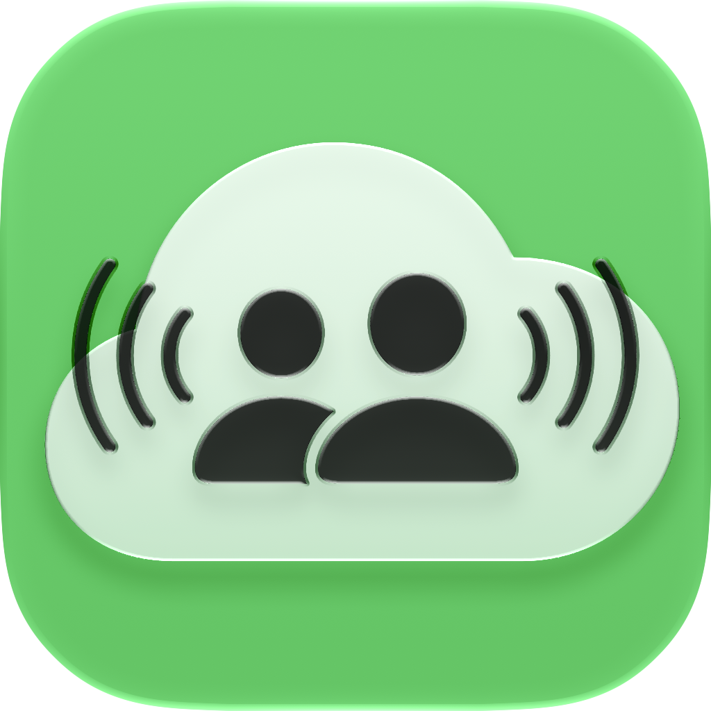

<h1 align="center">
    
  <p></p>
  <p align="center">Dialektik</p>
</h1>

A local-first, serverless portal for National Speech and Debate Association (NSDA) clubs. Manages debate rounds with P2P WebRTC connections, collaborative Yjs/CRDT document editing, AI coaching, evidence cards, and round history. All data is stored locally in IndexedDB (via Dexie.js) — no backend server required.

Licensed under [MIT License](LICENSE).

## Installation

Download the latest release for your platform:

| Platform | File |
|---|---|
| **macOS** | `Dialektik_macOS_v0.1.1.dmg` — open and drag to Applications |
| **iOS & iPadOS** | `Dialektik_iOS_iPadOS_v0.1.1.ipa` — install via TestFlight or sideload |
| **Web** | `Dialektik_web_v0.1.1.zip` — extract and serve the `Dialektik/` folder |

> [!NOTE]
> Because I do **NOT** have an Apple developer account for the app releases, you may receive alerts such as "Developer is not verified" on macOS.
>
> To resolve this, go to System Settings → the bottom of Privacy & Security → Open Dialektik.

### Web quick start

```bash
unzip Dialektik_web_v0.1.1.zip
cd Dialektik && python3 -m http.server 8080
# Open http://localhost:8080
```

Flutter web requires a local server — opening `index.html` directly will show a blank page. For production, deploy the `Dialektik/` folder to any static host (Cloudflare Pages, Vercel, etc.).

> **Note:** P2P WebRTC on web may be limited compared to native builds. For full functionality, use the macOS or iOS app.

> [!NOTE]
> You don't need to read the sections below if you are not a developer ☺️.

---

## Building from Source

### Prerequisites

- **Node.js** (v18 or higher)
- **Flutter SDK** (>=3.4.0, with Dart)
- **Xcode** (macOS/iOS builds)
- **CocoaPods** (iOS builds)

### Quick Start (Development)

```bash
# 1. Install JS dependencies
npm install

# 2. Build the JS engine bundle (required before running the app)
npm run engine:build

# 3. Run in development mode
npm run dev
```

The `engine:build` step compiles the TypeScript engine into `flutter_ui/assets/engine.js` and must be run before any `flutter run` invocation.

### Common Commands

| Command | Description |
|---|---|
| `npm run engine:build` | Build JS engine bundle (TypeScript → IIFE) |
| `npm run dev` | Run Flutter app (auto-detects macOS/Windows/Linux) |
| `npm run flutter:web` | Run in Chrome |
| `npm run flutter:ios` | Run on the first detected iOS device or simulator |
| `npm run flutter:analyze` | Dart static analysis |
| `npm run build` | Production build (auto-detects platform) |
| `npm run flutter:build:web` | Build Flutter web |
| `npm run flutter:build:ios` | Build iOS app |
| `cd flutter_ui && flutter test` | Run unit tests |

**Common inner loop:**
```bash
npm run engine:build && npm run flutter:web
```

### Production Builds

All builds require `npm run engine:build` first.

#### macOS
```bash
flutter build macos --release
npx create-dmg build/macos/Build/Products/Release/Dialektik.app Dialektik_macOS_v0.1.1.dmg
```

#### iOS & iPadOS
```bash
flutter build ios --release
```
Package as `.ipa` by copying the `.app` into a `Payload/` directory and zipping. Requires an Apple Developer account for device deployment.

#### Web
```bash
cd flutter_ui && flutter build web --release
```
Output: `build/web/` — deploy the contents to any static web server.

#### Windows (requires a Windows machine)
```bash
cd flutter_ui && flutter build windows --release
```
Prerequisites: Visual Studio 2022 with "Desktop development with C++" workload.

#### Android (requires Android Studio)
```bash
cd flutter_ui && flutter build apk --release
cd flutter_ui && flutter build appbundle --release  # Play Store
```

## Architecture

```
Flutter UI ──EngineBridge──> Hidden WebView ──> engine.js (TypeScript/IIFE)
  (dispatch JSON actions)       or                    |
  (receive JSON snapshots)    JS interop (web)        ├─ DialektikDB (Dexie/IndexedDB)
                                                      ├─ PeerMeshManager (WebRTC/PeerJS)
                                                      ├─ PeerJSYjsProvider (CRDT sync)
                                                      └─ AIService (OpenAI-compatible API)
```

### Key patterns

- **Unidirectional data flow**: Flutter sends JSON `{type, payload}` actions via `EngineBridge.dispatch()`. The JS engine processes them, updates IndexedDB, and pushes a full `AppSnapshot` JSON blob back. Flutter rebuilds its widget tree from the snapshot stream.
- **Platform-dependent bridge**: `EngineBridge` has two implementations — `JsEngineBridge` (native) uses a hidden `HeadlessInAppWebView` with the compiled `engine.js` bundle; `JsEngineBridge` (web) uses `dart:js_util` to call `window.dialektikEngine` directly.
- **Poll-based sync**: The bridge polls `getLatestSnapshot()` every 500ms (synchronous read of a cached `__latestSnapshot` string) to catch dropped messages.
- **Snapshot model**: Immutable `AppSnapshot` Dart classes parsed from JSON with top-level fields `activePage`, `documents`, `cards`, `history`, `session`, `ai`, and `settings`.

## Source Structure

```
├── src/                              # TypeScript engine (builds to engine.js)
│   ├── engine-entry.ts               # DB init, action dispatch, snapshot push
│   └── services/
│       ├── webrtc.ts                 # PeerMeshManager — full-mesh P2P via PeerJS
│       ├── yjs-provider.ts           # PeerJSYjsProvider — CRDT sync over data channels
│       └── ai.ts                     # AIService — OpenAI-compatible API client
├── flutter_ui/                       # Flutter application
│   ├── lib/
│   │   ├── main.dart                 # App entry + PreviewEngineBridge (dev)
│   │   └── src/
│   │       ├── app/dialektik_app.dart     # Root shell, snapshot subscription, routing
│   │       ├── bridge/                   # EngineBridge abstract + implementations
│   │       ├── models/app_snapshot.dart  # All snapshot model classes
│   │       ├── screens/                  # In-round, documents, AI, history, settings
│   │       └── widgets/adaptive_scaffold.dart  # ResponsivePane, EmptyState, etc.
│   └── assets/
│       ├── engine.html               # Host page for WebView bridge
│       └── engine.js                 # Compiled IIFE bundle
├── scripts/
│   ├── flutter-dev.mjs               # Dev launcher (auto-detects platform)
│   └── flutter-build.mjs             # Production build launcher
└── vite.config.engine.ts             # Vite config for engine.js IIFE bundle
```

## Local Multi-Peer Testing (Single Machine)

IndexedDB is per-origin, so two tabs in the same browser share the same database. To test host and client on one machine, isolate storage:

- **Separate browser profiles** — Chrome + Firefox, or Chrome's profile switcher
- **Normal + Incognito** — regular window and an incognito/private window
- **Preview Engine** — in-memory Dart simulation for UI testing without the hidden WebView (includes cross-tab sync via SharedPreferences)
