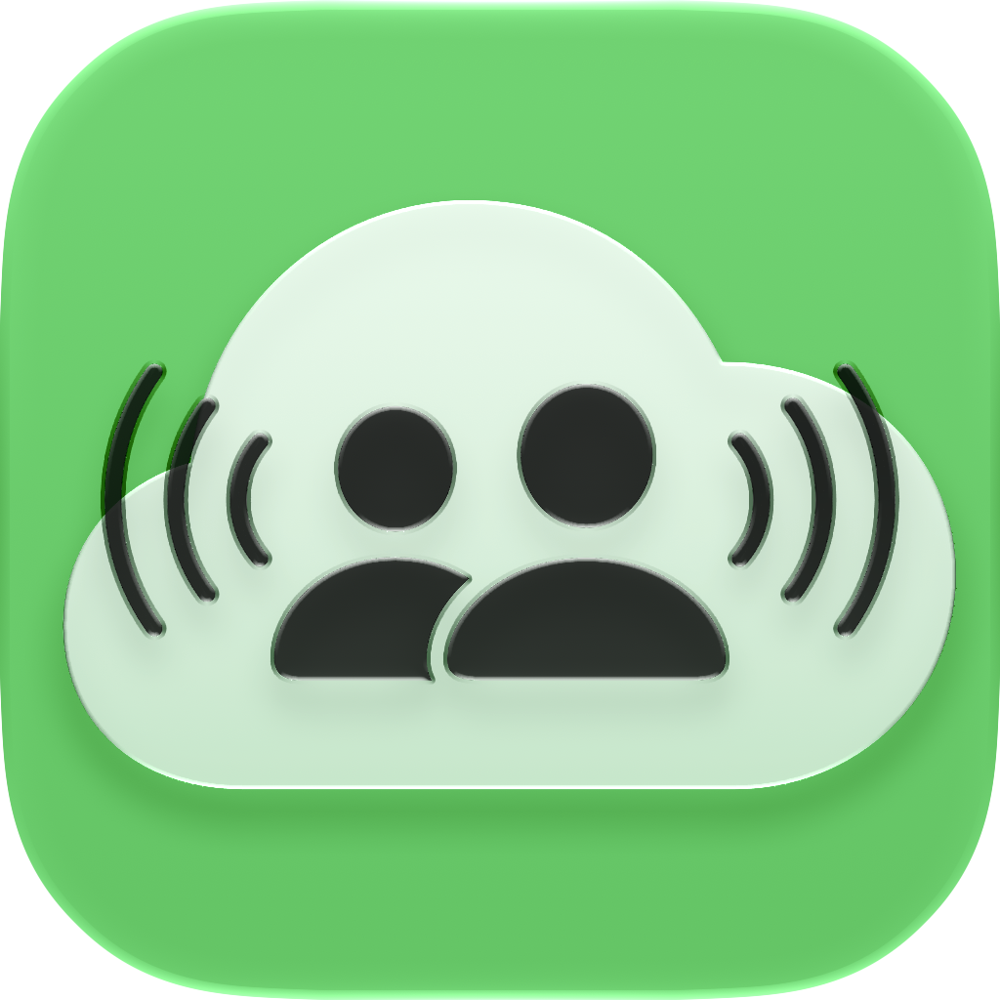

<h1 align="center">
  
  <p></p>
  <p align="center">Dialektik</p>
</h1>

A local-first, serverless portal for National Speech and Debate Association (NSDA) clubs. Dialektik manages debate rounds with P2P WebRTC connections, collaborative document editing, AI coaching, evidence cards, and round history. Workspace data is stored locally on your device — no backend server is required.

Licensed under the [MIT License](LICENSE).

## Installation

Download the latest release for your platform:

| Platform | File |
|---|---|
| **macOS** | `Dialektik_macOS_v0.3.0.dmg` — open and drag to Applications |
| **iOS & iPadOS** | `Dialektik_iOS_iPadOS_v0.3.0.ipa` — install via TestFlight or sideload |
| **Web** | `Dialektik_web_v0.3.0.zip` — extract and serve the `Dialektik/` folder |

> [!NOTE]
> Because I do **NOT** have an Apple developer account for the app releases, you may receive alerts such as “Developer is not verified” on macOS.
>
> To resolve this, go to System Settings → Privacy & Security → Open Dialektik.

### Web quick start

```bash
unzip Dialektik_web_v0.3.0.zip
cd Dialektik && python3 -m http.server 8080
# Open http://localhost:8080
```

Flutter web requires a local server — opening `index.html` directly will show a blank page. For production, deploy the `Dialektik/` folder to any static host.

> **Note:** P2P WebRTC on web may be limited compared to native builds. For full functionality, use the macOS or iOS app.

> [!NOTE]
> You don’t need to read the sections below if you are not a developer ☺️.

## Development setup

### Prerequisites

- Node.js 18 or newer
- Rust and Cargo
- The platform toolchain required by Tauri: Xcode on macOS/iOS, Android Studio for Android, or Visual Studio Build Tools on Windows

### Run the React frontend

```bash
npm ci
npm run engine:build
npm run dev
```

The development server runs at `http://localhost:1420`. The engine build creates the IIFE bundle used by the frontend at `frontend/public/engine.js`; that generated copy is ignored and is recreated by every engine build.

### Run the Tauri shell

```bash
npm run tauri:dev
```

Tauri runs `npm run engine:build` before starting the frontend. For a deployed relay, set the relay URL while building the engine:

```bash
DIALEKTIK_RELAY_URL=wss://relay.example.com npm run engine:build
```

### Common commands

| Command | Purpose |
|---|---|
| `npm run engine:build` | Compile the shared TypeScript engine and sync its frontend asset |
| `npm run dev` | Start the React/Vite development server |
| `npm run frontend:build` | Type-check and build the web frontend into `dist/` |
| `npm run frontend:preview` | Preview the production web build locally |
| `npm run tauri:dev` | Run the desktop/mobile Tauri shell in development |
| `npm run tauri:build` | Build signed or unsigned Tauri bundles for the current platform |
| `npm run relay:start` | Run the local in-memory WebSocket relay |
| `npm run flutter:analyze` | Analyze the v0.3 Flutter compatibility line |
| `cd flutter_ui && flutter test` | Run the v0.3 Flutter compatibility tests |

## Release builds

Run the following from the repository root:

```bash
npm ci
npm run tauri:build
```

Tauri writes platform bundles under `src-tauri/target/release/bundle/`. Typical outputs include:

- macOS: `.app`, `.dmg`, and `.tar.gz`
- Windows: `.msi` and `.exe`
- Linux: `.AppImage`, `.deb`, and related packages
- iOS and Android: platform-specific packages after the mobile target has been initialized

For mobile targets, initialize the platform once and then build with Tauri:

```bash
npx tauri ios init
npx tauri ios build

npx tauri android init
npx tauri android build
```

Before publishing a release:

1. Update the version in `package.json`, `src-tauri/Cargo.toml`, and `src-tauri/tauri.conf.json` together.
2. Run `npm run engine:build`, `npm run frontend:build`, and `npm run tauri:build`.
3. Run the frontend and Flutter compatibility tests.
4. Verify desktop navigation, mobile drawer navigation, room hosting/joining, document actions, evidence cards, AI settings, and history actions.
5. Generate the Sparkle delta from the previous macOS app and place it in `resources/sparkle/`.
6. Update `appcast.xml` only after the final DMG and delta signatures and lengths have been verified.

Do not commit `dist/`, `src-tauri/target/`, or generated `frontend/public/engine.js` files. The release source delta in `resources/sparkle/` is intentionally tracked.

## Architecture

```text
Tauri window ── React + Carbon ── EngineBridge ──> engine.js
       │             │
       │             └─ Tauri child webview for Google Docs (desktop)
                                                    ├─ Dexie / IndexedDB
                                                    ├─ PeerMeshManager / WebRTC
                                                    ├─ PeerJSYjsProvider / Yjs
                                                    └─ AIService / OpenAI-compatible API
```

The frontend follows the existing unidirectional contract:

- The engine publishes a complete JSON snapshot.
- React renders from the latest snapshot and keeps only transient UI state locally.
- User actions are sent as `{ type, payload }` JSON actions.
- `EngineBridge` polls `getLatestSnapshot()` every 500ms to tolerate dropped WebView messages.
- On desktop, Google Docs is mounted as a Tauri child webview positioned over the editor surface so authentication, cookies, popups, keyboard focus, and right-click behavior belong to the in-app document surface. The ordinary iframe is retained only for web/mobile preview fallback.
- The desktop navigation rail is collapsible. Documents are listed inside that rail when the Documents destination is active; the editor is not split by a second dashboard column.

The engine remains serverless and local-first. Network relay use is optional, and API keys are not included in workspace backups.

## Source structure

```text
├── src/                         # Shared TypeScript engine and networking services
├── frontend/                    # React + Carbon frontend and Vite configuration
│   ├── src/App.tsx              # Responsive application shell and pages
│   ├── src/engine.ts            # Snapshot/action bridge
│   └── src/styles.scss          # Carbon tokens plus restrained product layout rules
├── src-tauri/                   # Tauri desktop and mobile shell
├── flutter_ui/                  # Stable v0.3.0 Flutter compatibility line
├── resources/sparkle/           # Tracked Sparkle delta artifacts
└── scripts/                     # Engine synchronization and legacy build helpers
```

## Local multi-peer testing

IndexedDB is scoped to an origin. To test a host and client on one machine, use separate browser profiles, a normal window plus an incognito window, or the Tauri app plus a browser tab. Each isolated profile receives a separate local workspace while WebRTC connects the peers.
